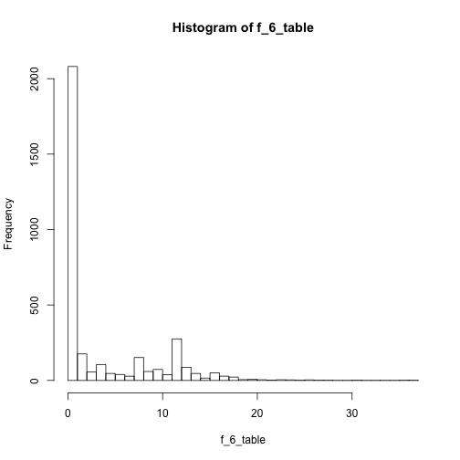
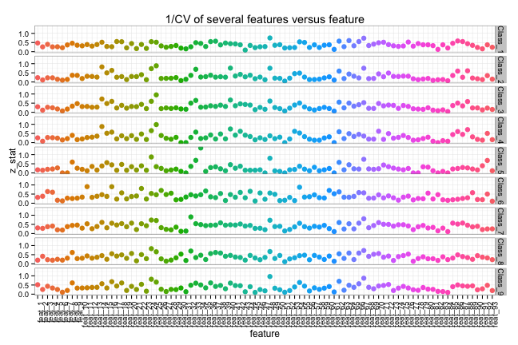
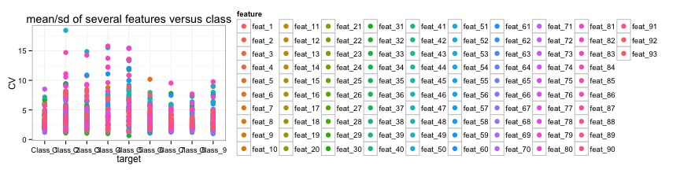
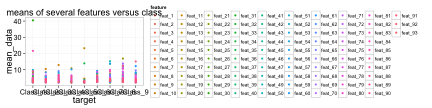
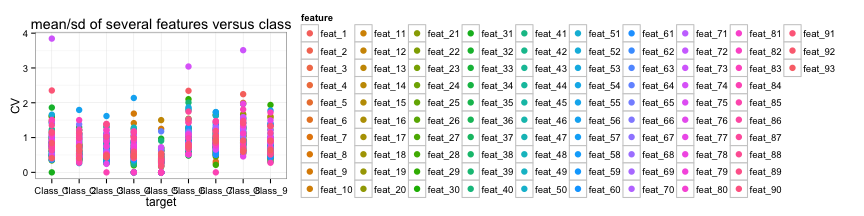

Product Classification
========================================================
transition: rotate
  
  
<br>  
<br>  
_Winston Saunders_   
_April 22, 2015_  
__Exploratory Summary__
 

 <br>
<small>R version 3.2.0 (2015-04-16)</small>

***
<br>  
<br>  


Grabbing the data
========================================================


The train data set has 61878 rows and 95 columns. Here is a sample of a few rows and columns. The target column has 9 classifiers:  
<small>
<!-- html table generated in R 3.2.0 by xtable 1.7-4 package -->
<!-- Mon Apr 27 23:26:39 2015 -->
<table border=1>
<tr> <th> id </th> <th> feat_1 </th> <th> feat_2 </th> <th> feat_3 </th> <th> feat_4 </th> <th> feat_5 </th> <th> feat_92 </th> <th> feat_93 </th> <th> target </th>  </tr>
  <tr> <td align="right">   1 </td> <td align="right">   1 </td> <td align="right">   0 </td> <td align="right">   0 </td> <td align="right">   0 </td> <td align="right">   0 </td> <td align="right">   0 </td> <td align="right">   0 </td> <td> Class_1 </td> </tr>
  <tr> <td align="right">   2 </td> <td align="right">   0 </td> <td align="right">   0 </td> <td align="right">   0 </td> <td align="right">   0 </td> <td align="right">   0 </td> <td align="right">   0 </td> <td align="right">   0 </td> <td> Class_1 </td> </tr>
  <tr> <td align="right">   3 </td> <td align="right">   0 </td> <td align="right">   0 </td> <td align="right">   0 </td> <td align="right">   0 </td> <td align="right">   0 </td> <td align="right">   0 </td> <td align="right">   0 </td> <td> Class_1 </td> </tr>
  <tr> <td align="right">   4 </td> <td align="right">   1 </td> <td align="right">   0 </td> <td align="right">   0 </td> <td align="right">   1 </td> <td align="right">   6 </td> <td align="right">   0 </td> <td align="right">   0 </td> <td> Class_1 </td> </tr>
   </table>
</small>  
The number of elements in each class is shown below.
<small>   
<!-- html table generated in R 3.2.0 by xtable 1.7-4 package -->
<!-- Mon Apr 27 23:26:39 2015 -->
<table border=1>
<tr> <th> Class_1 </th> <th> Class_2 </th> <th> Class_3 </th> <th> Class_4 </th> <th> Class_5 </th> <th> Class_6 </th> <th> Class_7 </th> <th> Class_8 </th> <th> Class_9 </th>  </tr>
  <tr> <td align="right"> 1929 </td> <td align="right"> 16122 </td> <td align="right"> 8004 </td> <td align="right"> 2691 </td> <td align="right"> 2739 </td> <td align="right"> 14135 </td> <td align="right"> 2839 </td> <td align="right"> 8464 </td> <td align="right"> 4955 </td> </tr>
   </table>
</small> 


Create data sample
========================================================
To get some data for inspection first create a random sample of 15000 rows. This speeds up calculations. 


> The sampled train_data has 15000 rows and 95 columns. 


Inspect
======================================

What does a specific feat look like? Look at table of values for feat\_60 for Class\_6


 
***

 


Munging
=========================================
For plotting etc. convert data to a "long" format with each observation, characterized by a target class and feature, in one unique row.
<small>

```r
## Get packages
require(plyr); require(ggplot2); require(tidyr)
## munge data into long format 
long_train<-gather(train_data, feature, data, feat_1:feat_93)
```

Note that the dimension of this new data frame 1395000 is equal to 15000 X (95 - 2).

Here is a sample...   (the table has 1395000 rows)
<!-- html table generated in R 3.2.0 by xtable 1.7-4 package -->
<!-- Mon Apr 27 23:26:40 2015 -->
<table border=1>
<tr> <th> id </th> <th> target </th> <th> feature </th> <th> data </th>  </tr>
  <tr> <td align="right"> 9869 </td> <td> Class_2 </td> <td> feat_1 </td> <td align="right">   0 </td> </tr>
  <tr> <td align="right"> 29589 </td> <td> Class_5 </td> <td> feat_1 </td> <td align="right">   0 </td> </tr>
  <tr> <td align="right"> 47323 </td> <td> Class_7 </td> <td> feat_1 </td> <td align="right">   0 </td> </tr>
  <tr> <td align="right"> 47625 </td> <td> Class_7 </td> <td> feat_1 </td> <td align="right">   1 </td> </tr>
   </table>
</small>  
First summary
============================================

Let's look at the means and std deviations of the features by class....

<small>

```r
## use ddply to get means and standard deviations
train_morph<-ddply(long_train, c("target", "feature"), summarize, mean_data = mean(data), sdev_data = sqrt(var(data)))


## calculate inverse coeff of variation 
## (which I will label as z_stat for later use)
## add small value to prevent overflow errors
train_morph$z_stat<-train_morph$mean_data/(train_morph$sdev_data+0.00001)
train_morph$CV<-(train_morph$sdev_data)/(train_morph$mean_data+0.001)
```
</small>

Train_Morph
======================================


```r
print(xtable(train_morph[1:6,]), type="html",include.rownames = FALSE)
```

<!-- html table generated in R 3.2.0 by xtable 1.7-4 package -->
<!-- Mon Apr 27 23:26:41 2015 -->
<table border=1>
<tr> <th> target </th> <th> feature </th> <th> mean_data </th> <th> sdev_data </th> <th> z_stat </th> <th> CV </th>  </tr>
  <tr> <td> Class_1 </td> <td> feat_1 </td> <td align="right"> 0.44 </td> <td align="right"> 1.05 </td> <td align="right"> 0.42 </td> <td align="right"> 2.37 </td> </tr>
  <tr> <td> Class_1 </td> <td> feat_2 </td> <td align="right"> 0.12 </td> <td align="right"> 0.46 </td> <td align="right"> 0.26 </td> <td align="right"> 3.84 </td> </tr>
  <tr> <td> Class_1 </td> <td> feat_3 </td> <td align="right"> 0.19 </td> <td align="right"> 0.49 </td> <td align="right"> 0.38 </td> <td align="right"> 2.61 </td> </tr>
  <tr> <td> Class_1 </td> <td> feat_4 </td> <td align="right"> 0.12 </td> <td align="right"> 0.41 </td> <td align="right"> 0.31 </td> <td align="right"> 3.24 </td> </tr>
  <tr> <td> Class_1 </td> <td> feat_5 </td> <td align="right"> 0.27 </td> <td align="right"> 1.17 </td> <td align="right"> 0.23 </td> <td align="right"> 4.34 </td> </tr>
  <tr> <td> Class_1 </td> <td> feat_6 </td> <td align="right"> 0.09 </td> <td align="right"> 0.42 </td> <td align="right"> 0.23 </td> <td align="right"> 4.37 </td> </tr>
   </table>


Means and CV for all classes
=========================================

 

Here is the CV = sd/mean

 

>some variation with class, but low mean/sd = 1/CV means noisy correlations!

1/CV features for each class
===================================


This is beginning to look promising. We can see at least some variation between classes & features (though others are weak)

</small>  
Second Summary
============================================

Let's get rid of all the data that is <= 0.


```r
long_train_original<-long_train
long_train<-long_train[long_train$data>0,]
```

the size of the original matrix was 1395000 and the size of the new matrix is 288275.

<small>

</small>

Train_Morph the new data
======================================


```r
print(xtable(train_morph[1:6,]), type="html",include.rownames = FALSE)
```

<!-- html table generated in R 3.2.0 by xtable 1.7-4 package -->
<!-- Mon Apr 27 23:26:46 2015 -->
<table border=1>
<tr> <th> target </th> <th> feature </th> <th> mean_data </th> <th> sdev_data </th> <th> z_stat </th> <th> CV </th>  </tr>
  <tr> <td> Class_1 </td> <td> feat_1 </td> <td align="right"> 1.79 </td> <td align="right"> 1.43 </td> <td align="right"> 1.26 </td> <td align="right"> 0.80 </td> </tr>
  <tr> <td> Class_1 </td> <td> feat_2 </td> <td align="right"> 1.38 </td> <td align="right"> 0.85 </td> <td align="right"> 1.64 </td> <td align="right"> 0.61 </td> </tr>
  <tr> <td> Class_1 </td> <td> feat_3 </td> <td align="right"> 1.25 </td> <td align="right"> 0.53 </td> <td align="right"> 2.36 </td> <td align="right"> 0.42 </td> </tr>
  <tr> <td> Class_1 </td> <td> feat_4 </td> <td align="right"> 1.30 </td> <td align="right"> 0.46 </td> <td align="right"> 2.81 </td> <td align="right"> 0.36 </td> </tr>
  <tr> <td> Class_1 </td> <td> feat_5 </td> <td align="right"> 3.24 </td> <td align="right"> 2.67 </td> <td align="right"> 1.21 </td> <td align="right"> 0.82 </td> </tr>
  <tr> <td> Class_1 </td> <td> feat_6 </td> <td align="right"> 1.59 </td> <td align="right"> 0.75 </td> <td align="right"> 2.13 </td> <td align="right"> 0.47 </td> </tr>
   </table>


Means and CV for all classes
=========================================

 

Here is the CV = sd/mean

 

>some variation with class, but low mean/sd = 1/CV means noisy correlations!

1/CV features for each class
===================================


This is beginning to look promising. We can see at least some variation between classes & features (though others are weak)


Another look
==================================

Here the mean and 1/CV within a product class is plotted with color coded for the target class. 


Another look
==================================

If we require that 1/CV be above 0.5 (arbitrarily)


>This starts to look selective  


Decision Tree Class1 vs Class2 
===================================

Decision trees also appear to offer a good way to distinguish.


Tree Plot (pruned to cp=0.02)
===================================

This shows just a few features (e.g. 17, 78, and 84) can do a pretty good job discriminating between Class\_1 and Class\_2. 


Decision Tree Class1 vs Class6 
===================================

Here's a look at a different pairing (Class\_1 and CLass\_6)


Tree Plot (pruned to cp=0.02)
===================================

This shows many more features (e.g. 8, 78, 6, &c.) are needed to discriminate between Class\_1 and Class\_6. Though feat\_78 is common between the two analyses.


Next Steps
=========================================

Examine more pairwise trees.  
Understand if the variable _values_ contribute information.   
Run generic random forest as benchmark.  

>Cheers!


