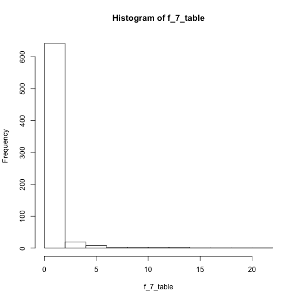

Exploratory Summary
========================================================
author: Winston Saunders
date: April 20 2015
transition: rotate


***


Grabbing the data
========================================================


The train data set has 61878 rows and 95 columns. 

<small>

<!-- html table generated in R 3.1.3 by xtable 1.7-4 package -->
<!-- Mon Apr 20 16:42:09 2015 -->
<table border=1>
<tr> <th> id </th> <th> feat_1 </th> <th> feat_2 </th> <th> feat_3 </th> <th> feat_4 </th> <th> feat_5 </th> <th> feat_92 </th> <th> feat_93 </th> <th> target </th>  </tr>
  <tr> <td align="right">   1 </td> <td align="right">   1 </td> <td align="right">   0 </td> <td align="right">   0 </td> <td align="right">   0 </td> <td align="right">   0 </td> <td align="right">   0 </td> <td align="right">   0 </td> <td> Class_1 </td> </tr>
  <tr> <td align="right">   2 </td> <td align="right">   0 </td> <td align="right">   0 </td> <td align="right">   0 </td> <td align="right">   0 </td> <td align="right">   0 </td> <td align="right">   0 </td> <td align="right">   0 </td> <td> Class_1 </td> </tr>
  <tr> <td align="right">   3 </td> <td align="right">   0 </td> <td align="right">   0 </td> <td align="right">   0 </td> <td align="right">   0 </td> <td align="right">   0 </td> <td align="right">   0 </td> <td align="right">   0 </td> <td> Class_1 </td> </tr>
  <tr> <td align="right">   4 </td> <td align="right">   1 </td> <td align="right">   0 </td> <td align="right">   0 </td> <td align="right">   1 </td> <td align="right">   6 </td> <td align="right">   0 </td> <td align="right">   0 </td> <td> Class_1 </td> </tr>
   </table>
</small>
The number of elements in each class is shown below.
<small>
<!-- html table generated in R 3.1.3 by xtable 1.7-4 package -->
<!-- Mon Apr 20 16:42:09 2015 -->
<table border=1>
<tr> <th> Class_1 </th> <th> Class_2 </th> <th> Class_3 </th> <th> Class_4 </th> <th> Class_5 </th> <th> Class_6 </th> <th> Class_7 </th> <th> Class_8 </th> <th> Class_9 </th>  </tr>
  <tr> <td align="right"> 1929 </td> <td align="right"> 16122 </td> <td align="right"> 8004 </td> <td align="right"> 2691 </td> <td align="right"> 2739 </td> <td align="right"> 14135 </td> <td align="right"> 2839 </td> <td align="right"> 8464 </td> <td align="right"> 4955 </td> </tr>
   </table>
</small>


Create a data sample
========================================================
My computer can't handle the full matrix easily, so first step is to create a sample


The sampled train data set now has 4000 rows and 32 columns. 

<small>

<!-- html table generated in R 3.1.3 by xtable 1.7-4 package -->
<!-- Mon Apr 20 16:42:10 2015 -->
<table border=1>
<tr> <th> id </th> <th> feat_1 </th> <th> feat_84 </th> <th> feat_77 </th> <th> feat_92 </th> <th> feat_15 </th> <th> feat_79 </th> <th> target </th>  </tr>
  <tr> <td align="right"> 9869 </td> <td align="right">   0 </td> <td align="right">   0 </td> <td align="right">   0 </td> <td align="right">   0 </td> <td align="right">   0 </td> <td align="right">   0 </td> <td> Class_2 </td> </tr>
  <tr> <td align="right"> 29589 </td> <td align="right">   0 </td> <td align="right">   0 </td> <td align="right">   0 </td> <td align="right">   0 </td> <td align="right">   0 </td> <td align="right">   1 </td> <td> Class_5 </td> </tr>
  <tr> <td align="right"> 47323 </td> <td align="right">   0 </td> <td align="right">   0 </td> <td align="right">   0 </td> <td align="right">   0 </td> <td align="right">   0 </td> <td align="right">   0 </td> <td> Class_7 </td> </tr>
  <tr> <td align="right"> 47625 </td> <td align="right">   1 </td> <td align="right">   0 </td> <td align="right">   0 </td> <td align="right">   0 </td> <td align="right">   2 </td> <td align="right">   0 </td> <td> Class_7 </td> </tr>
   </table>

</small>


Munging
========================================================

To get the data analyzable convert it to a "long" format.
<small>

```r
## Get required packages
require(plyr); require(ggplot2); require(tidyr)
```


```r
## use tidyr package to munge the data into a long format 
long_train<-gather(train_data, feature, data, feat_1:feat_93)
```

<!-- html table generated in R 3.1.3 by xtable 1.7-4 package -->
<!-- Mon Apr 20 16:42:11 2015 -->
<table border=1>
<tr> <th> id </th> <th> target </th> <th> feature </th> <th> data </th>  </tr>
  <tr> <td align="right"> 9869 </td> <td> Class_2 </td> <td> feat_1 </td> <td align="right">   0 </td> </tr>
  <tr> <td align="right"> 29589 </td> <td> Class_5 </td> <td> feat_1 </td> <td align="right">   0 </td> </tr>
  <tr> <td align="right"> 47323 </td> <td> Class_7 </td> <td> feat_1 </td> <td align="right">   0 </td> </tr>
  <tr> <td align="right"> 47625 </td> <td> Class_7 </td> <td> feat_1 </td> <td align="right">   1 </td> </tr>
  <tr> <td align="right"> 16617 </td> <td> Class_2 </td> <td> feat_1 </td> <td align="right">   0 </td> </tr>
  <tr> <td align="right"> 41644 </td> <td> Class_6 </td> <td> feat_1 </td> <td align="right">   0 </td> </tr>
   </table>
</small>

First summary
============================================

<small>

```r
## use ddply to get means and standard deviations
train_morph<-ddply(long_train, c("target", "feature"), summarize, mean_data = mean(data), sdev_data = sqrt(var(data)))


## calculate z-stat
## add small value to prevent overflow errors
train_morph$z_stat<-train_morph$mean_data/(train_morph$sdev_data+0.00001)
```
</small>

Plot1
=========================================

 

