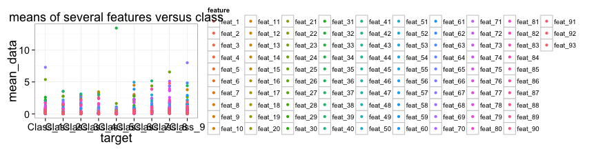

Product Classification
========================================================
transition: rotate
  
  
<br>  
<br>  
_Winston Saunders_   
_April 22, 2015_  
__Exploratory Summary__
 

 
<small>R version 3.2.0 (2015-04-16)</small>

***
<br>  
<br>  


Grabbing the data
========================================================


The train data set has 61878 rows and 95 columns. Here is a sample of a few rows and columns. The target column has 9 classifiers:  
<small>
<!-- html table generated in R 3.2.0 by xtable 1.7-4 package -->
<!-- Wed Apr 22 22:49:14 2015 -->
<table border=1>
<tr> <th> id </th> <th> feat_1 </th> <th> feat_2 </th> <th> feat_3 </th> <th> feat_4 </th> <th> feat_5 </th> <th> feat_92 </th> <th> feat_93 </th> <th> target </th>  </tr>
  <tr> <td align="right">   1 </td> <td align="right">   1 </td> <td align="right">   0 </td> <td align="right">   0 </td> <td align="right">   0 </td> <td align="right">   0 </td> <td align="right">   0 </td> <td align="right">   0 </td> <td> Class_1 </td> </tr>
  <tr> <td align="right">   2 </td> <td align="right">   0 </td> <td align="right">   0 </td> <td align="right">   0 </td> <td align="right">   0 </td> <td align="right">   0 </td> <td align="right">   0 </td> <td align="right">   0 </td> <td> Class_1 </td> </tr>
  <tr> <td align="right">   3 </td> <td align="right">   0 </td> <td align="right">   0 </td> <td align="right">   0 </td> <td align="right">   0 </td> <td align="right">   0 </td> <td align="right">   0 </td> <td align="right">   0 </td> <td> Class_1 </td> </tr>
  <tr> <td align="right">   4 </td> <td align="right">   1 </td> <td align="right">   0 </td> <td align="right">   0 </td> <td align="right">   1 </td> <td align="right">   6 </td> <td align="right">   0 </td> <td align="right">   0 </td> <td> Class_1 </td> </tr>
   </table>
</small>  
The number of elements in each class is shown below.
<small>   
<!-- html table generated in R 3.2.0 by xtable 1.7-4 package -->
<!-- Wed Apr 22 22:49:14 2015 -->
<table border=1>
<tr> <th> Class_1 </th> <th> Class_2 </th> <th> Class_3 </th> <th> Class_4 </th> <th> Class_5 </th> <th> Class_6 </th> <th> Class_7 </th> <th> Class_8 </th> <th> Class_9 </th>  </tr>
  <tr> <td align="right"> 1929 </td> <td align="right"> 16122 </td> <td align="right"> 8004 </td> <td align="right"> 2691 </td> <td align="right"> 2739 </td> <td align="right"> 14135 </td> <td align="right"> 2839 </td> <td align="right"> 8464 </td> <td align="right"> 4955 </td> </tr>
   </table>
</small> 


Create data sample and munge
========================================================
To get some data for inspection first create a random sample of 4000 rows. This speeds up calculations. 


<small>

```r
sample_rows <- sample(1:dim(train_data)[1], 4000)
```
</small>
> The sampled train_data has 4000 rows and 95 columns. 


Munging (cont.)
=========================================
and then for plotting etc. convert it to a "long" format with each observation in one unique row.
<small>

```r
## Get packages
require(plyr); require(ggplot2); require(tidyr)
## munge data into long format 
long_train<-gather(train_data, feature, data, feat_1:feat_93)
```
Here is a sample...   (the table has 372000 rows)
<!-- html table generated in R 3.2.0 by xtable 1.7-4 package -->
<!-- Wed Apr 22 22:49:15 2015 -->
<table border=1>
<tr> <th> id </th> <th> target </th> <th> feature </th> <th> data </th>  </tr>
  <tr> <td align="right"> 9869 </td> <td> Class_2 </td> <td> feat_1 </td> <td align="right">   0 </td> </tr>
  <tr> <td align="right"> 29589 </td> <td> Class_5 </td> <td> feat_1 </td> <td align="right">   0 </td> </tr>
  <tr> <td align="right"> 47323 </td> <td> Class_7 </td> <td> feat_1 </td> <td align="right">   0 </td> </tr>
  <tr> <td align="right"> 47625 </td> <td> Class_7 </td> <td> feat_1 </td> <td align="right">   1 </td> </tr>
  <tr> <td align="right"> 16617 </td> <td> Class_2 </td> <td> feat_1 </td> <td align="right">   0 </td> </tr>
  <tr> <td align="right"> 41644 </td> <td> Class_6 </td> <td> feat_1 </td> <td align="right">   0 </td> </tr>
   </table>
</small>  
First summary
============================================

Let's look at the means and std deviations of the features by class....

<small>

```r
## use ddply to get means and standard deviations
train_morph<-ddply(long_train, c("target", "feature"), summarize, mean_data = mean(data), sdev_data = sqrt(var(data)))


## calculate inverse coeff of variation 
## (which I will label as z_stat for later use)
## add small value to prevent overflow errors
train_morph$z_stat<-train_morph$mean_data/(train_morph$sdev_data+0.00001)
```
</small>

Means and sd for all classes
=========================================

 


 

>some variation with class, but low mean/sd = 1/CV means noisy correlations!

1/CV features for each class
===================================


This is beginning to look promising. We can see at least some variation between classes & features (though others are weak)


Another look
==================================

Here the mean and 1/CV within a product class is plotted with color coded for the target class. 


Another look
==================================

If we require that 1/CV be above 0.5 (arbitrarily)


>This starts to look selective  


Decision Tree Class1 vs Class2 vs. Class 3
===================================

Decision trees also appear to offer a good way to distinguish.


Tree Plot (pruned to cp=0.016)
===================================

